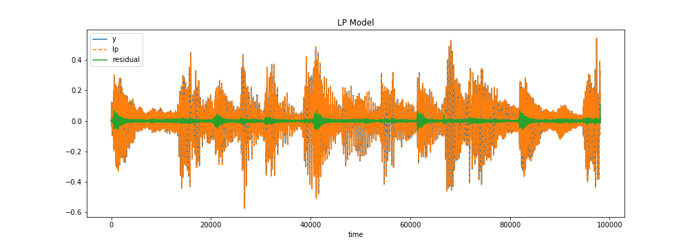
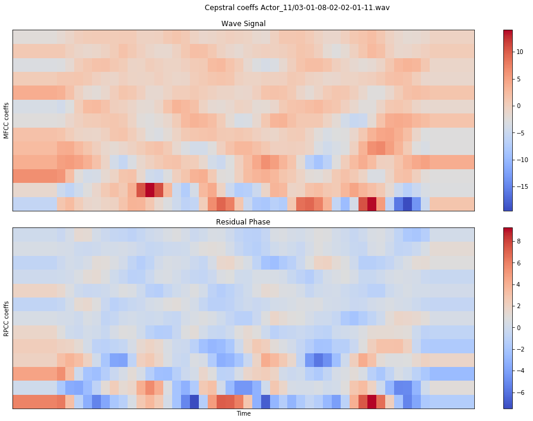
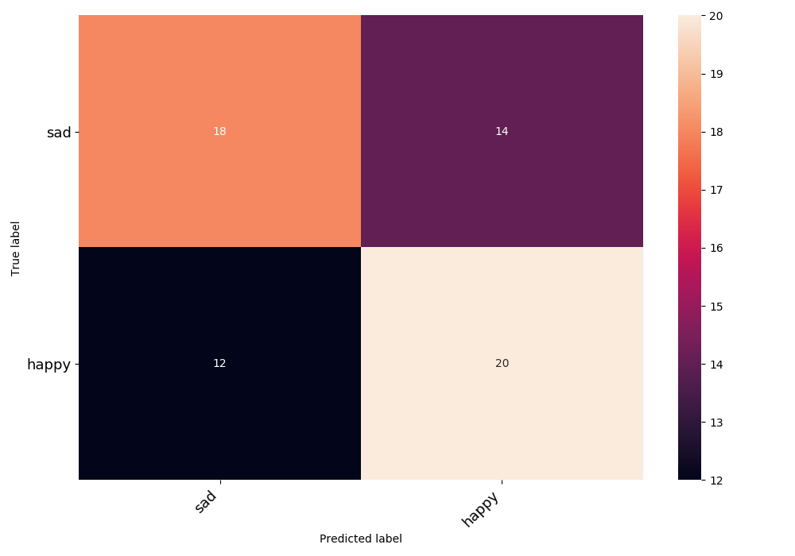
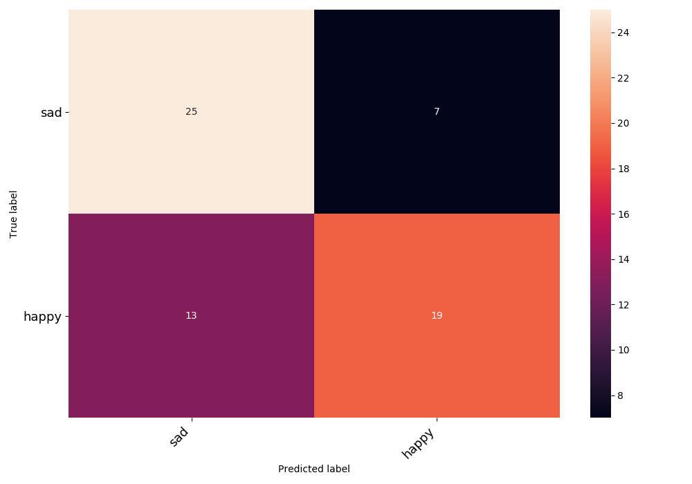

# Audio emotion classification using residual phase cepstral coefficients

This repository contains the code to train a convolutional neural network (CNN) model for speech emotion recognition based on residual phase cepstral coefficients (RPCCs). <br>
The performance of the trained model is compared to the performance of a CNN model with same architecture trained on mel-frequency cepstral coefficients.

## Introduction

A speech signal is represented as the joint contribution of both excitation source and vocal tract modulation. The former produced at the instants of glottal closure following a spoken utterance, the latter produced by the movement of the vocal tract articulators at different places. <br>
During production of speech human beings impose emotional cues on the produced sound. It has been observed that the rate of glottis vibrations, as well as the strength and the sharpness of significant excitation at glottal closure are specific to each emotion [1].

[1] Emotion Recognition using Speech Features, Rao, K. et al., Springer (2013)

## Linear prediction analysis and residual phase 

To deconvolve the given speech into excitation and vocal tract system components, inverse filtering methods based on Linear Prediction (LP) analysis are used. <br>
Inverse filtering of a speech signal removes the excitation source contribution from the speech signal, that are primary excitation to the vocal tract system. The result signal is known as a Linear prediction (LP) and its error is known as LP residual. 

While speech is being produced, the relative LP has large residual around the onset of bursts and around the instants of glottal closure (see figure below), as it reflects in instantaneous frequency and phase changes in the speech envelope.



Speaker recognition studies have demonstrated that the phase of the LP residual, the **residual phase**, defined as the cosine of the phase function of the analytic LP residual, contains the speaker specific information [2]. In this work, I use the residual phase to extract emotion-specific information from a speech audio.

[2] K. S. R. Murty and B. Yegnanarayana, “Combining evidence from residual phase and mfcc features for speaker recognition,” IEEE SIGNAL PROCESSING LETTERS, vol. 13, pp.52–55, January 2006.

## Cepstral coefficients

To extract emotion-specific features from the speech files, I converted the time-varying audio signal as well as its residual phase into cepstral coefficients representing the envelope of the short-time power spectrum on a nonlinear mel scale of frequency. For detailed description of the cepstral coefficients check [here](http://practicalcryptography.com/miscellaneous/machine-learning/guide-mel-frequency-cepstral-coefficients-mfccs/).



## Data set

To train the CNN model, I used the *Ryerson Audio-Visual Database of Emotional Speech and Song* [RAVDESS](https://zenodo.org/record/1188976#.XN0fwnUzZhE), containing professional actors vocalizing two lexically-matched statements in a neutral North American accent. <br>
In this analysis I trained a model to classify male actors on 'happy', 'sad' speech expressions.

## CNN model

I developed the CNN model with Keras constructed with 9 layers: 8 Conv1D layers followed by a Dense layer.
Similar model architectures have been 

in speech recognition models. 


```
    model = Sequential()
    model.add(Conv1D(256, 8, padding='same', input_shape=(X_input_shape, 1)))
    model.add(Activation('relu'))
    model.add(Conv1D(256, 8, padding='same'))
    model.add(BatchNormalization())
    model.add(Activation('relu'))
    model.add(Dropout(0.25))
    model.add(MaxPooling1D(pool_size=(8)))
    model.add(Conv1D(128, 8, padding='same'))
    model.add(Activation('relu'))
    model.add(Conv1D(128, 8, padding='same'))
    model.add(Activation('relu'))
    model.add(Conv1D(128, 8, padding='same'))
    model.add(Activation('relu'))
    model.add(Conv1D(128, 8, padding='same'))
    model.add(BatchNormalization())
    model.add(Activation('relu'))
    model.add(Dropout(0.25))
    model.add(MaxPooling1D(pool_size=(8)))
    model.add(Conv1D(64, 8, padding='same'))
    model.add(Activation('relu'))
    model.add(Conv1D(64, 8, padding='same'))
    model.add(Activation('relu'))
    model.add(Flatten())
    model.add(Dense(2))
    model.add(Activation('softmax'))

```

The model was trained in 300 epochs on batch_size=16, and optimized using stochastic gradient descent. <br>
During training, the model loss was monitored on a validation set by categorical cross-entropy using validation metric accuracy.

## Results

The performance of the trained MFCCs- and RPCCs-based CNN models were tested on a separate set. The relative accuracy scores were  calculated:

- MFCCs-CNN model accuracy = 59.38 %
- RPCCs-CNN model accuracy = 68.75 %

The plots below show the relative confusion matrices

MFCCs-CNN model <br>


RPCCs-CNN model <br>



The RPCCs-CNN model shows overall better performance compared to the MFCCs-CNN model.
In particular, the RPCCs-CNN model outperforms the MFCCs-CNN model in predicting 'sad' speeches. <br>

## Next steps

Note that the model has been trained on a subset of emotional classes. It would be interesting to check the performance of a similar model trained on different emotional classes, and gender. <br>

Please contact me if you would like to contribute to this project!

## Content structure

This repository is organized in the following structure:

- `analysis/` folder, containg the scripts for the analysis workflow.
- `notebooks/` folder, contains the jupyter notebooks.
- `aux/` folder, containing auxiliary functions.

Please create a `./data/` folder and put all of the RAVDESS data inside.


## Package requirements

Please refers to the requirement file: [requirements.txt](requirements.txt)
